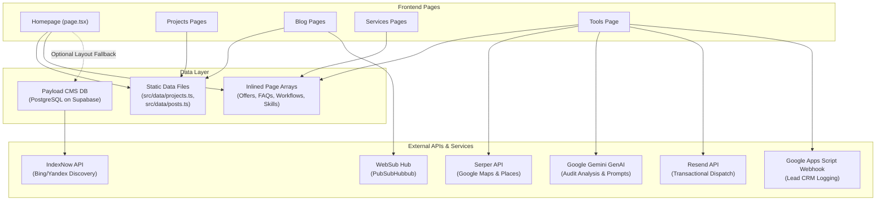
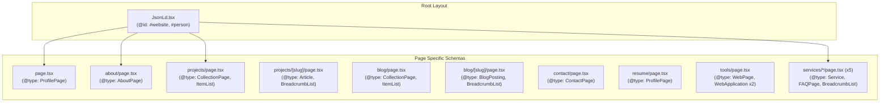

# Forensic Architecture Audit: Current State Report (Task 00)

> **Document Status:** READ-ONLY ARCHITECTURAL BASELINE
> **Auditor:** Senior Next.js Software Architect
> **Target Application:** Alain Dave Tapiru Portfolio & Technical SEO Platform (`payload-website`)
> **Date:** August 2026
> **Production Code Modification:** NONE (Zero files modified)

---

## 1. Actual Framework and Dependency Version Map

The application runs on a modern, high-velocity bleeding-edge Next.js and React stack, configured with headless Payload CMS and Supabase PostgreSQL.

### Core Runtime & Framework
| Package / Technology | Version in `package.json` | Classification / Architectural Role |
| :--- | :--- | :--- |
| **Next.js** | `16.3.0` | App Router Core, Turbopack Bundler, Server Actions, Route Handlers |
| **React** | `19.2.8` | Server Component Architecture, Actions, Transitions |
| **React DOM** | `19.2.8` | DOM Rendering & Portal Support |
| **TypeScript** | `6.0.3` (dev) | Static Type Checking (`target: ES2022`, `moduleResolution: bundler`) |
| **Node.js Target** | `>=24.15.0` | Server Runtime Engine |
| **Package Manager** | `pnpm` (`^9 \|\| ^10 \|\| ^11`) | Monorepo / Dependency Engine (`pnpm-lock.yaml`) |

### CMS, Database & Content Infrastructure
| Package / Dependency | Version in `package.json` | Classification / Architectural Role |
| :--- | :--- | :--- |
| **Payload CMS Core** (`payload`) | `latest` (~`3.88.x`) | Embedded Headless CMS Core |
| **@payloadcms/next** | `latest` | Payload Next.js App Router Integration (`withPayload`) |
| **@payloadcms/db-postgres** | `latest` | PostgreSQL Adapter connecting to Supabase Pool |
| **@payloadcms/richtext-lexical** | `latest` | Headless Rich-Text Editor Engine |
| **@payloadcms/plugin-seo** | `latest` | Automatic Meta Title & Description Generator |
| **@payloadcms/plugin-mcp** | `latest` | Model Context Protocol Plugin for AI tooling |
| **@payloadcms/ui** | `latest` | Admin Panel UI components |
| **@payloadcms/live-preview-react** | `latest` | Real-time Frontend Preview Listener Hook |
| **sharp** | `0.34.2` | High-performance Native Image Processing Engine |
| **graphql** | `^16.8.1` | GraphQL Schema Engine for Payload Admin API |

### Styling & Design System
| Package / Dependency | Version in `package.json` | Classification / Architectural Role |
| :--- | :--- | :--- |
| **Tailwind CSS** | `^4.3.3` | Tailwind v4 Utility Engine |
| **@tailwindcss/postcss** | `^4.3.3` | PostCSS Plugin for Tailwind v4 |
| **PostCSS** | `^8.5.26` | CSS Preprocessing Pipeline |
| **Autoprefixer** | `^10.5.4` | Vendor Prefix Engine |
| **Custom Tokens** | `src/app/(frontend)/styles.css` | Material Design 3 (M3) Obsidian & Amber Noir Color Space |

### Form Validation, State & Client Utilities
| Package / Dependency | Version in `package.json` | Classification / Architectural Role |
| :--- | :--- | :--- |
| **react-hook-form** | `^7.85.0` | Performant Uncontrolled Client Form Engine |
| **@hookform/resolvers** | `^5.9.0` | Hook Form Resolver for Zod Schemas |
| **zod** | `^4.4.3` | Type-safe Schema Validation (Forms, Server Actions) |
| **lucide-react** | `^1.31.0` | SVG Icon Library (GBP Checker, UI Buttons) |
| **react-markdown** | `^10.1.0` | Client-side Markdown Parser for AI Output |

### External APIs, AI & Analytics
| Package / Dependency | Version in `package.json` | Classification / Architectural Role |
| :--- | :--- | :--- |
| **@google/genai** | `^2.16.0` | Google Gemini SDK for GBP AI Recommendations |
| **@next/third-parties** | `^16.3.0` | Official Next.js Google Analytics 4 Script Loader |
| **next/web-vitals** | Built-in | Real-User Measurement (RUM) Core Web Vitals Tracking |
| **Serper API** | REST (`SERPER_API_KEY`) | Google Maps / Places SERP Scraping & Signals |
| **Resend API** | REST (`RESEND_API_KEY`) | Transactional Email Dispatch Engine |
| **Google Apps Script** | Webhook | Lead Capture & Spreadsheet CRM Dispatch |

### Quality Assurance, Testing & Tooling
| Package / Dependency | Version in `package.json` | Classification / Architectural Role |
| :--- | :--- | :--- |
| **@playwright/test** | `1.59.1` | End-to-End Test Suite (`tests/e2e/`) |
| **vitest** | `4.1.6` | Fast Unit / Integration Test Engine (`tests/int/`) |
| **@testing-library/react** | `16.3.0` | Component Unit Testing Utilities |
| **jsdom** | `28.0.0` | DOM Simulation for Vitest |
| **tsx** | `4.22.4` | Standalone TypeScript Execution for Scripts |
| **eslint** / **eslint-config-next** | `^9.16.0` / `16.3.0` | Static Code Quality & Linter |
| **prettier** | `^3.4.2` | Code Formatting Engine |

---

## 2. Repository Tree and Architecture Map

```text
My Main Website Portfolio Project/
├── docs/                                  # Architectural & Roadmap Documentation
│   ├── plan.md                            # High-level Platform Plan & Blueprint
│   └── architecture/                      # Architectural Audit Deliverables (Task 00)
│       ├── CURRENT_STATE.md               # Factual System Architecture Audit
│       ├── RISK_REGISTER.md               # Prioritized Risk Register
│       └── ROUTE_MAP.md                   # Complete Route & Boundary Inventory
├── payload-website/                       # Active Next.js & Payload Codebase
│   ├── next.config.ts                     # Next.js 16 Config (Redirects, Security Headers, Images)
│   ├── package.json                       # Dependencies & Lifecycle Scripts
│   ├── tsconfig.json                      # TypeScript 6.0 Config (Path Aliases @/*, @payload-config)
│   ├── tailwind.config.ts                 # Tailwind v4 Configuration & Typography Extends
│   ├── postcss.config.mjs                 # PostCSS Pipeline (@tailwindcss/postcss)
│   ├── eslint.config.mjs                  # Flat ESLint Configuration
│   ├── playwright.config.ts               # E2E Testing Configuration
│   ├── vitest.config.mts                  # Vitest Configuration
│   ├── .env.example                       # Environment Variable Declarations
│   ├── scripts/                           # Quality Assurance Verification Scripts
│   │   ├── audit-forms.ts                 # Form Delivery Automated Health Checker
│   │   ├── verify-accessibility.ts        # Automated a11y & ARIA Validator
│   │   ├── verify-performance.ts          # Performance Metric Profiler
│   │   └── verify-search-and-perf.ts      # Search Indexing & TTFB Profiler
│   ├── tests/                             # Test Suites
│   │   ├── e2e/                           # Playwright E2E Tests (Admin & Frontend)
│   │   ├── helpers/                       # Test Login & User Seeding Utilities
│   │   └── int/                           # Integration Tests
│   ├── public/                            # Static Assets
│   │   ├── Alain_Dave_Tapiru_Resume.pdf   # Direct Download PDF Resume
│   │   ├── alain-dave-tapiru-seo-*.avif   # Profile & Hero Portraits (Avif/Webp)
│   │   ├── a8f9c1b2d3e4f5061728394a5b6c7d8e.txt # IndexNow Ownership Key
│   │   ├── branding/                      # Vector & High-Res Logos
│   │   ├── hero-frames/                   # 120 WebP Animation Frames (Legacy / Dead Asset)
│   │   └── images/                        # Blog & Case Study Media Assets
│   └── src/
│       ├── payload.config.ts              # Payload CMS Central Configuration
│       ├── payload-types.ts               # Generated Payload Database TypeScript Types
│       ├── seed.ts                        # Initial Database Seeder
│       ├── app/                           # Next.js App Router Structure
│       │   ├── robots.ts                  # Programmatic robots.txt with AI Crawler Allow-list
│       │   ├── sitemap.ts                 # Dynamic XML Sitemap Generation
│       │   ├── (frontend)/                # Public Website Route Group
│       │   │   ├── layout.tsx             # Root HTML, Fonts, Theme, GA4, Shader, Nav/Footer
│       │   │   ├── styles.css             # Obsidian & Amber M3 Design System Tokens
│       │   │   ├── page.tsx               # Homepage (Hero, Marquee, Scope, FAQS, CTA)
│       │   │   ├── about/page.tsx         # Biography, Methodology & Credentials
│       │   │   ├── blog/                  # Blog Archive & Dynamic Post Routes
│       │   │   │   ├── page.tsx           # Blog Index & RSS Subscription Callout
│       │   │   │   └── [slug]/page.tsx    # Article Body, TOC, Code Blocks, Schema
│       │   │   ├── contact/page.tsx       # Calendly Booking & Direct Inquiry Form
│       │   │   ├── projects/              # Projects Directory & Case Studies
│       │   │   │   ├── page.tsx           # Projects Directory with Interactive Filter
│       │   │   │   ├── [slug]/page.tsx    # 5-Part Case Study Breakdown & Evidence
│       │   │   │   └── _[slug]/page.tsx   # Legacy / Private Unrouted Page (Dead Code)
│       │   │   ├── resume/page.tsx        # Structured Web Resume & PDF Preview Lightbox
│       │   │   ├── services/              # SEO & Web Development Services
│       │   │   │   ├── page.tsx           # Services Hub & Scope Estimator
│       │   │   │   ├── technical-seo/page.tsx
│       │   │   │   ├── on-page-seo/page.tsx
│       │   │   │   ├── local-seo/page.tsx
│       │   │   │   ├── ai-search-optimization/page.tsx
│       │   │   │   └── web-development/page.tsx
│       │   │   ├── tools/                 # Interactive Tools Suite
│       │   │   │   ├── layout.tsx         # Metadata Provider for Tools Page
│       │   │   │   └── page.tsx           # Salary Calculator, GBP Health Checker, Audit Form
│       │   │   ├── [...slug]/page.tsx     # Catch-all Dynamic Payload CMS Page Fallback
│       │   │   └── api/                   # Frontend-specific Route Handlers
│       │   │       ├── gbp-audit/route.ts # Google Maps & Gemini Local SEO Engine (1,381 lines)
│       │   │       └── preview/route.ts   # Payload Live Preview Draft Mode Handler
│       │   ├── (payload)/                 # Payload Admin Route Group
│       │   │   ├── custom.css             # Payload Admin Custom Styles
│       │   │   ├── layout.tsx             # Admin Panel Layout Wrapper
│       │   │   ├── admin/[[...segments]]/ # Payload Admin GUI Pages
│       │   │   └── api/                   # Payload REST & GraphQL Endpoints
│       │   │       ├── graphql/route.ts
│       │   │       ├── graphql-playground/route.ts
│       │   │       └── [...slug]/route.ts
│       │   ├── actions/                   # Next.js Server Actions (Mutation & Email)
│       │   │   ├── send-audit-report.ts   # GBP PDF/HTML Audit Report Dispatch (797 lines)
│       │   │   ├── send-contact.ts        # Contact Inquiry Form Dispatch (271 lines)
│       │   │   └── send-website-audit-request.ts # Technical Audit Request Dispatch (507 lines)
│       │   ├── api/                       # Global Machine-Discoverability Endpoints
│       │   │   ├── indexnow/route.ts      # IndexNow URL Ping Protocol Dispatcher
│       │   │   └── websub/route.ts        # PubSubHubbub / WebSub Hub Ping Dispatcher
│       │   ├── feed.xml/route.ts          # 308 Permanent Redirect to /rss.xml
│       │   ├── rss.xml/route.ts           # Dynamic RSS 2.0 Delta XML Feed with PubSub Hub
│       │   ├── llms.txt/route.ts          # AI Agent / LLM Fast-Context Markdown Specification
│       │   ├── llms-full.txt/route.ts     # AI Agent Full Corpus & Case Study Specification
│       │   └── my-route/route.ts          # Unused Example Route (Dead Code)
│       ├── blocks/                        # Payload CMS Layout Blocks
│       │   └── CodeInjection.ts           # HTML/CSS/JS Injection Block Definition
│       ├── collections/                   # Payload CMS Collections
│       │   ├── Users.ts                   # Admin Auth Users
│       │   ├── Media.ts                   # CMS Media Library Uploads
│       │   ├── Folders.ts                 # Media Organization Folders
│       │   ├── Tags.ts                    # Taxonomy Tags
│       │   ├── Pages.ts                   # Editable Static Pages with IndexNow Hooks
│       │   └── AIMemory.ts                # Brand Voice & Target Keyword Context
│       ├── components/                    # UI Component Library (39 Components)
│       │   ├── GBPHealthChecker.tsx       # 10-Point GBP Signal Analyzer (1,600 lines)
│       │   ├── Navbar.tsx                 # Responsive Floating Nav & Dropdowns (661 lines)
│       │   ├── ContactForm.tsx            # React Hook Form + Zod Lead Form
│       │   ├── WebsiteAuditRequestForm.tsx# Preliminary Audit Request Component
│       │   ├── ShaderBackground.tsx       # Custom WebGL Obsidian Amber Fragment Shader
│       │   ├── ScrollHero.tsx             # 2-Column Hero Component
│       │   ├── ThemeProvider.tsx          # React Context Theme Provider (Dark/Light)
│       │   ├── GoogleAnalytics.tsx        # GA4 + Web Vitals RUM Reporter
│       │   ├── JsonLd.tsx                 # Global Person & WebSite Schema Graph
│       │   ├── Breadcrumbs.tsx            # Visual & Semantic Breadcrumbs
│       │   ├── TableOfContents.tsx        # Blog Scroll-Spy Heading Directory
│       │   ├── CalendlyScheduler.tsx      # Lazy-loaded Calendly Embed
│       │   └── ... (27 other components)
│       ├── data/                          # In-Memory Static Domain Data
│       │   ├── projects.ts                # Structured Case Studies (3 Projects)
│       │   └── posts.ts                   # Structured Blog Guides (1 In-Depth Guide)
│       ├── hooks/                         # Custom React Hooks
│       │   └── useModalFocus.ts           # Keyboard Accessibility & Modal Focus Trap
│       ├── lib/                           # Core Domain Utilities & Schema Helpers
│       │   ├── seo.ts                     # Metadata Builder, Canonical & JSON-LD Serializer
│       │   ├── indexnow.ts                # IndexNow Protocol API Client
│       │   ├── websub.ts                  # WebSub Hub Protocol API Client
│       │   └── schemas/                   # Zod Validation Schemas (Contact & Audit)
│       └── plugins/                       # Custom Payload CMS Plugins
│           └── ai-seo/index.ts            # AI SEO Document Analysis Hook (Stub)
```

---

## 3. Data-Source Map

The application utilizes a **hybrid multi-tier data architecture**:



1. **Static In-Memory Data (`src/data/`)**:
   - `src/data/projects.ts`: Holds data for 3 structured case studies (`angat-sikat-studio`, `local-seo-gbp-checker`, `alaintapiru-portfolio`).
   - `src/data/posts.ts`: Holds the complete markdown/data structure for the blog article (`is-seo-dead-2026`).
2. **Inlined Component / Page Arrays**:
   - `STARTING_OFFERS`, `PROCESS_STAGES`, `HOMEPAGE_FAQS` in `src/app/(frontend)/page.tsx`.
   - `SKILL_CATEGORIES`, `EXPERIENCES` in `src/app/(frontend)/resume/page.tsx`.
   - `TECHNICAL_AUDIT_AREAS`, `PROBLEMS_SOLVED`, `WORKFLOW_STEPS`, `TECH_STACK_TOOLS`, `FAQS` in each of the 5 `services/*/page.tsx` files.
3. **Payload Headless CMS (`src/collections/`)**:
   - Stores `Pages`, `Media`, `Folders`, `Tags`, `Users`, `AIMemory`.
   - Polled gracefully on `page.tsx` (`slug: 'index'`) and dynamically on `[...slug]/page.tsx`.
4. **Third-Party Dynamic Services**:
   - **Serper API**: Server-side Google Maps queries inside `api/gbp-audit/route.ts`.
   - **Google Gemini AI**: AI reasoning & prompt evaluation inside `api/gbp-audit/route.ts`.
   - **Resend API**: Triggered from Server Actions (`send-contact.ts`, `send-website-audit-request.ts`, `send-audit-report.ts`).
   - **Google Sheets Webhook**: Lead notification webhook in all Server Actions.
   - **IndexNow & WebSub**: Dispatched on demand and via Payload CMS change hooks.

---

## 4. Component Ownership Map

| Component File | Size / Lines | Direct Imports / Dependencies | Consumer / Rendering Parent | Classification |
| :--- | :--- | :--- | :--- | :--- |
| `GBPHealthChecker.tsx` | 79.7 KB / 1,600 L | `react-markdown`, `lucide-react`, `send-audit-report.ts`, `useModalFocus` | `tools/page.tsx` | Interactive Tool Engine |
| `Navbar.tsx` | 34.3 KB / 661 L | `next/link`, `next/image`, `next/navigation`, `AnnouncementBanner`, `ThemeToggle` | `(frontend)/layout.tsx` | Global Layout Shell |
| `ProjectsDirectory.tsx` | 20.6 KB / 467 L | `next/image`, `next/link`, `PROJECTS` from `src/data/projects` | `projects/page.tsx` | Filterable Case Studies |
| `ServicesScopeEstimator.tsx` | 20.4 KB / 434 L | `next/link`, `lucide-react`, `Icon` | `services/page.tsx` | Interactive Cost Estimator |
| `PerformanceAuditProof.tsx` | 19.9 KB / 412 L | `next/image`, `Icon` | `projects/[slug]/page.tsx` | Evidence & Lightbox Viewer |
| `AboutCredentials.tsx` | 18.4 KB / 391 L | `react-dom` (Portal), `useModalFocus`, `Icon` | `about/page.tsx` | Credentials & Certificate Modal |
| `ContactForm.tsx` | 18.4 KB / 362 L | `react-hook-form`, `zod`, `send-contact.ts` | `contact/page.tsx` | Interactive Form |
| `ToolsMarquee.tsx` | 15.7 KB / 217 L | `lucide-react` (Pause/Play) | `page.tsx` (Homepage) | Accessibility-Paused Marquee |
| `ServicesPackages.tsx` | 15.3 KB / 295 L | `next/link`, `Icon` | `services/page.tsx` | Server Component Package Cards |
| `WebsiteAuditRequestForm.tsx` | 13.6 KB / 285 L | `send-website-audit-request.ts`, `Icon` | `tools/page.tsx` | Interactive Audit Request Form |
| `ShaderBackground.tsx` | 13.4 KB / 396 L | WebGL APIs, `ThemeProvider` | `(frontend)/layout.tsx` | Background Visual Shader |
| `ServicesHubGrid.tsx` | 13.3 KB / 236 L | `next/link`, `Icon` | `services/page.tsx` | Server Component Services Grid |
| `Footer.tsx` | 12.4 KB / 193 L | `next/image`, `next/link`, `RssButton` | `(frontend)/layout.tsx` | Static Footer (Unnecessary Client) |
| `ServicesPillars3And4.tsx` | 10.9 KB / 181 L | `next/link`, `Icon` | *None* | **Dead Code Candidate** |
| `ScrollHero.tsx` | 10.6 KB / 137 L | `next/image`, `next/link`, `Icon` | `page.tsx` (Homepage) | Static Hero (Unnecessary Client) |
| `ServicesFinalCta.tsx` | 10.0 KB / 214 L | `next/link`, `Icon`, `serializeJsonLd` | `services/page.tsx` | Server Component Conversion Section |
| `ServicesWorkflowAndFAQ.tsx` | 9.9 KB / 231 L | `Icon` (React useState accordion) | `services/page.tsx` | Client Accordion Section |
| `TrustCommitment.tsx` | 9.9 KB / 199 L | `Icon` | *None* | **Dead Code Candidate** |
| `ServicesPillar2.tsx` | 7.0 KB / 164 L | `next/link`, `Icon` | *None* | **Dead Code Candidate** |
| `GBPHomepageCallout.tsx` | 6.6 KB / 149 L | `next/link`, `Icon` | *None* | **Dead Code Candidate** |
| `TableOfContents.tsx` | 6.6 KB / 167 L | `IntersectionObserver`, `Icon` | `blog/[slug]/page.tsx` | Sticky Table of Contents |
| `ServicesPillar1.tsx` | 6.1 KB / 133 L | `next/link`, `Icon` | *None* | **Dead Code Candidate** |
| `HomepageFAQ.tsx` | 4.7 KB / 107 L | `Icon` | *None* | **Dead Code Candidate** |
| `ServicesHero.tsx` | 3.9 KB / 83 L | `next/link`, `Icon` | `services/page.tsx` | Server Component Services Hero |
| `Breadcrumbs.tsx` | 3.3 KB / 92 L | `next/link`, `serializeJsonLd`, `Icon` | Multiple Pages | Server Component Breadcrumb Nav |
| `AnnouncementBanner.tsx` | 3.3 KB / 77 L | `next/link`, `lucide-react`, `localStorage` | `Navbar.tsx` | Dismissible Client Alert |
| `CodeBlock.tsx` | 2.9 KB / 81 L | `lucide-react` | `blog/[slug]/page.tsx` | Copy-to-Clipboard Code Viewer |
| `ThemeToggle.tsx` | 2.8 KB / 63 L | `ThemeProvider`, `Icon` | `Navbar.tsx` | Theme Switch Button |
| `OpenToOpportunities.tsx` | 2.4 KB / 63 L | `Icon` | *None* | **Dead Code Candidate** |
| `JsonLd.tsx` | 2.4 KB / 67 L | `serializeJsonLd` from `src/lib/seo` | `(frontend)/layout.tsx` | Global Person & WebSite Schema |
| `RssButton.tsx` | 2.3 KB / 64 L | `Icon` | `blog/page.tsx`, `Footer.tsx` | Server Component Link |
| `ThemeProvider.tsx` | 2.0 KB / 73 L | React Context, `localStorage` | `(frontend)/layout.tsx` | Global Theme Context Provider |
| `ScrollRevealInit.tsx` | 1.7 KB / 46 L | `IntersectionObserver` | `(frontend)/layout.tsx` | Client Scroll Reveal Observer |
| `GoogleAnalytics.tsx` | 1.0 KB / 34 L | `@next/third-parties`, `next/web-vitals`| `(frontend)/layout.tsx` | Client GA4 & RUM Monitor |
| `RenderBlocks/index.tsx` | 0.6 KB / 24 L | Payload Block Renderer | `page.tsx`, `[...slug]/page.tsx` | Server Component Block Switcher |
| `LivePreviewListener/index.tsx` | 0.6 KB / 19 L | `@payloadcms/live-preview-react` | `page.tsx`, `[...slug]/page.tsx` | Payload Preview Client Listener |
| `icons/index.tsx` | 17.2 KB / 389 L | Inline SVG dictionary | Everywhere | Pure SVG Icon Dispatcher |

---

## 5. "use client" Inventory & Classification

Out of 39 components and 15 page routes, **28 files** declare the `'use client'` directive:

### Required Client Components (20 files)
These components utilize React hooks (`useState`, `useEffect`, `useCallback`, `useTransition`), browser APIs (`IntersectionObserver`, `localStorage`, `navigator.clipboard`, `createPortal`, WebGL), or client-specific SDK hooks:
1. `src/hooks/useModalFocus.ts` (DOM keyboard focus trapping, escape key listener)
2. `src/components/ThemeProvider.tsx` (React Context, DOM data-theme mutation, localStorage)
3. `src/components/ThemeToggle.tsx` (Consumes `useTheme` context, click handlers)
4. `src/components/GoogleAnalytics.tsx` (Consumes `useReportWebVitals` hook)
5. `src/components/ScrollRevealInit.tsx` (Attaches `IntersectionObserver` to reveal classes)
6. `src/components/ShaderBackground.tsx` (Attaches WebGL canvas, requestAnimationFrame loop)
7. `src/components/Navbar.tsx` (Mobile menu state, dropdowns, scroll listener, `usePathname`)
8. `src/components/AnnouncementBanner.tsx` (Dismissal state, localStorage sync)
9. `src/components/ContactForm.tsx` (`react-hook-form`, `useTransition`, form submission state)
10. `src/components/WebsiteAuditRequestForm.tsx` (`useState`, `useTransition`, server action dispatch)
11. `src/components/GBPHealthChecker.tsx` (Multi-stage interactive wizard, live fetch, modal portals)
12. `src/components/CalendlyScheduler.tsx` (`IntersectionObserver`, dynamic script loader)
13. `src/components/ProjectsDirectory.tsx` (Active filter category state, modal lightbox dialog)
14. `src/components/ResumePdfPreview.tsx` (PDF modal preview dialog, keyboard trap)
15. `src/components/PerformanceAuditProof.tsx` (Tab switching, image modal dialog)
16. `src/components/AboutCredentials.tsx` (Certificate modal lightbox, download triggers)
17. `src/components/ServicesScopeEstimator.tsx` (Interactive dynamic pricing & timeline calculator)
18. `src/components/TableOfContents.tsx` (`IntersectionObserver` heading scroll spy)
19. `src/components/CodeBlock.tsx` (Copy-to-clipboard state, `navigator.clipboard`)
20. `src/components/LivePreviewListener/index.tsx` (Payload Live Preview hook)

### Probably Required Client Components (2 files)
21. `src/components/ToolsMarquee.tsx` (Has interactive Pause/Play toggle with `useState`; could be CSS-only if pause button was removed, but pause button satisfies WCAG 2.2.2 criteria).
22. `src/components/ServicesWorkflowAndFAQ.tsx` (Uses `useState` for accordion open/close; could alternatively use native HTML `<details>` like `page.tsx`).

### Suspicious Client Components (4 files)
23. `src/app/(frontend)/tools/page.tsx` (**Architecture Defect:** The entire page is marked `'use client'` because of the inline `SalaryCalculator` state. This prevented exporting Next.js server `metadata` directly from `page.tsx`, requiring a redundant `tools/layout.tsx` wrapper).
24. `src/components/TrustCommitment.tsx` (Dead code candidate; marked `'use client'` without interactive hooks).
25. `src/components/GBPHomepageCallout.tsx` (Dead code candidate; marked `'use client'`).
26. `src/components/HomepageFAQ.tsx` (Dead code candidate; marked `'use client'`, superseded by native `<details>` in `page.tsx`).

### Unnecessary Client Components (2 files)
27. `src/components/Footer.tsx` (**100% Static Markup:** Contains zero hooks, zero state, zero browser APIs. Sending it to the client as a client component bundle is unnecessary).
28. `src/components/ScrollHero.tsx` (**100% Static Markup:** Converted from canvas frame scrubber to a 2-column layout with static images and CSS animations. Contains zero hooks, zero state, zero browser APIs).

---

## 6. Payload CMS & Supabase Ownership Map

### Payload CMS 3.0 Configuration (`src/payload.config.ts`)
- **Configured Collections:**
  - `Users` (`src/collections/Users.ts`): Admin authentication.
  - `Media` (`src/collections/Media.ts`): File uploads and media assets.
  - `Folders` (`src/collections/Folders.ts`): Nested folder structure.
  - `Tags` (`src/collections/Tags.ts`): Taxonomy tags.
  - `Pages` (`src/collections/Pages.ts`): Page builder with `CodeInjection` block and `afterChange`/`afterDelete` IndexNow webhooks.
  - `AIMemory` (`src/collections/AIMemory.ts`): Stores brand voice, target audience, and keyword clusters.
- **Configured Plugins:**
  - `seoPlugin`: Generates metadata for `pages` collection.
  - `aiSeoPlugin` (`src/plugins/ai-seo/index.ts`): Custom plugin stub for OpenAI analysis.
- **Admin Panel URL:** `/admin` (`src/app/(payload)/admin/[[...segments]]/page.tsx`).

### Database Ownership & Connection
- **Adapter:** `@payloadcms/db-postgres`
- **Database Connection String:** `DATABASE_URI` (pointing to Supabase PostgreSQL pool).
- **Client SDKs:** There is **NO** `@supabase/supabase-js` SDK in `package.json`. Supabase acts purely as the hosted PostgreSQL database for Payload CMS.
- **Frontend Isolation:** Direct database calls are isolated to `page.tsx` and `[...slug]/page.tsx` via `getPayload({ config })`. All other frontend routes read from static TS data or handle mutations via Next.js Server Actions.

---

## 7. SEO, Metadata, Canonical, and Schema Ownership Map

### Metadata & Canonical URL Ownership
- **Primary Generator:** `src/lib/seo.ts` exports `generateMetadata({ title, description, url, image, type })` and `normalizeCanonicalUrl(rawUrl)`.
- **Enforcement Rules:**
  - Enforces `https://www.alaintapiru.com/` as `metadataBase`.
  - Enforces strict lower-case trailing slashes on all canonical URLs.
  - Enforces OpenGraph (`1200x630`), Twitter Card (`summary_large_image`), and Googlebot indexing directives (`max-image-preview: large`).
  - Next.js 16 Host & Route Redirects in `next.config.ts` redirect non-www (`alaintapiru.com`) to `www.alaintapiru.com` and force trailing slashes.

### JSON-LD & Structured Data Entity Graph Map
The repository generates Schema.org JSON-LD across **14 distinct touchpoints**:



- **Global Entities:** `WebSite` (`#website`), `Person` (`#person` with `sameAs` array covering LinkedIn, GitHub, Facebook, WhatsApp).
- **Schema Fragmentation Finding:** Rather than assembling modular graph nodes through a centralized builder, every single page in `src/app/(frontend)/` manually defines a massive inline JSON-LD object literal and injects it via `<script type="application/ld+json" dangerouslySetInnerHTML={{ __html: serializeJsonLd(...) }}>`.

---

## 8. Analytics & Animation Ownership Map

### Analytics & Real-User Monitoring (RUM)
- **Component:** `src/components/GoogleAnalytics.tsx`
- **Measurement ID:** `process.env.NEXT_PUBLIC_GA_MEASUREMENT_ID || 'G-2VK6KQNJGH'`
- **Mechanism:**
  - Loads Google Analytics 4 via `@next/third-parties/google` (`NextGoogleAnalytics`).
  - Listens to browser Core Web Vitals via `next/web-vitals` (`useReportWebVitals`).
  - Emits real-user performance events (`sendGAEvent('event', 'web_vital', ...)`) for CLS, LCP, INP, FCP, and TTFB.

### Animation & Motion Architecture
- **No Framer Motion:** Zero JavaScript animation libraries (`framer-motion` is not installed).
- **Scroll Reveal Engine:** `src/components/ScrollRevealInit.tsx` sets up a lightweight `IntersectionObserver` observing `.motion-reveal` and `.motion-reveal-fast` classes, adding `.is-revealed` on scroll.
- **Hardware-Accelerated WebGL Background:** `src/components/ShaderBackground.tsx` runs an ambient fragment shader on an HTML5 canvas. Features:
  - Multi-octave Simplex & FBM noise.
  - Interactive mouse coordinate light tracking.
  - Smooth light/dark theme interpolation.
  - Automatic frame pausing when tab is hidden or user has `prefers-reduced-motion: reduce`.
- **CSS Micro-interactions:** `src/app/(frontend)/styles.css` handles `btn-motion`, `card-interactive-glow`, and infinite marquee keyframes.

---

## 9. Dependency Risk Map

| Dependency | Specified Version | Risk Severity | Concrete Risk Description |
| :--- | :--- | :--- | :--- |
| **Payload Packages** (`@payloadcms/*`, `payload`) | `"latest"` | **HIGH** | Using `"latest"` floating version range in `package.json` can cause build breaks on fresh CI/CD installations when breaking changes are published upstream. |
| **Next.js** | `16.3.0` | **MEDIUM** | Next.js 16.3.0 is a cutting-edge canary/early release. Any framework changes require validating Turbopack compatibility. |
| **React / React DOM** | `19.2.8` | **MEDIUM** | React 19 canary runtime. Requires testing for hydration compatibility across client components. |
| **TypeScript** | `6.0.3` | **LOW** | TypeScript 6.0 preview in `devDependencies`. Currently compiles cleanly with `noEmit: true`. |
| **Zod** | `^4.4.3` | **LOW** | Zod v4 syntax. Used across Server Actions and contact schemas without deprecation warnings. |

---

## 10. Oversized Files & Complexity Analysis

### Top 10 Largest Source Files
1. `src/components/GBPHealthChecker.tsx` — **79,704 bytes (1,600 lines)**
   - *Issues:* Monolithic component mixing multi-step wizard state, Gemini AI response rendering, category benchmarking, competitor table, email report form, portal modal dialogs, and SVG rendering.
2. `src/app/(frontend)/api/gbp-audit/route.ts` — **54,790 bytes (1,381 lines)**
   - *Issues:* Massive backend handler mixing Serper API queries, HTML scraping, regex category matching (800+ lines of category rules), prompt engineering, and Gemini LLM orchestration.
3. `src/app/(frontend)/services/web-development/page.tsx` — **35,344 bytes (731 lines)**
4. `src/app/(frontend)/services/technical-seo/page.tsx` — **35,209 bytes (726 lines)**
5. `src/app/actions/send-audit-report.ts` — **35,035 bytes (797 lines)**
   - *Issues:* Combines Zod validation, Google Sheet webhook fallback, Resend API dispatch, and 500+ lines of raw HTML/plain-text email templating.
6. `src/app/(frontend)/services/local-seo/page.tsx` — **34,477 bytes (718 lines)**
7. `src/components/Navbar.tsx` — **34,278 bytes (661 lines)**
   - *Issues:* Giant navigation component containing extensive inline SVG icons, mobile menu drawer, desktop dropdowns, CTA buttons, and announcement banner.
8. `src/app/(frontend)/services/ai-search-optimization/page.tsx` — **34,201 bytes (711 lines)**
9. `src/app/(frontend)/services/on-page-seo/page.tsx` — **33,223 bytes (698 lines)**
10. `src/app/(frontend)/resume/page.tsx` — **31,509 bytes (673 lines)**

---

## 11. Essential Complexity vs. Accidental Complexity

### Essential Complexity (DO NOT DESTROY)
- **GBP Health Checker Engine:** 10-point local SEO diagnostic heuristics, Serper API integration, and Gemini AI report generation.
- **Server Action Dispatch Pipelines:** Multi-channel notification strategy (Google Sheets webhook for CRM + Resend for transactional email delivery).
- **Core Web Vitals RUM System:** Next.js `useReportWebVitals` callback streaming real-user data to GA4.
- **Search & Machine Discoverability Protocol:** Complete suite of `/sitemap.xml`, `/robots.txt`, `/rss.xml`, `/llms.txt`, `/llms-full.txt`, IndexNow pings, and WebSub pings.
- **WebGL Ambient Shader:** Custom GLSL fragment shader delivering visual identity with full reduced-motion safeguards.
- **Rich Schema Entity Graphs:** Linked Knowledge Graph structured data (`WebSite`, `Person`, `Service`, `Article`, `LocalBusiness`).

### Accidental Complexity (REFACTOR TARGETS IN FUTURE PHASES)
- **Massive Service Page Duplication:** 5 service pages duplicate 700+ lines of identical layout structure, heading patterns, and FAQ styling.
- **Scattered JSON-LD Object Literals:** 14 separate files duplicate `Person` and `WebSite` schema nodes inline instead of importing reusable graph builders from `@/lib/seo`.
- **Monolithic Component Files:** `GBPHealthChecker.tsx` (1,600 lines) and `gbp-audit/route.ts` (1,381 lines) combine multiple concerns into single monolithic files.
- **Embedded Email Templates:** Over 1,200 lines of raw HTML table strings embedded directly inside Server Action files (`send-audit-report.ts`, `send-contact.ts`, `send-website-audit-request.ts`).
- **Unnecessary Client Boundaries:** `Footer.tsx` and `ScrollHero.tsx` marked with `'use client'` despite having zero hooks or browser APIs.
- **Page-level Client Boundary on Tools:** `tools/page.tsx` marked `'use client'`, necessitating a separate `tools/layout.tsx` wrapper for metadata.
- **Dead Code Candidates:** 8 unused component files, 1 private opted-out route (`_[slug]`), 1 boilerplate route (`my-route`), and 120 unreferenced image frames (`hero-frames/`).
